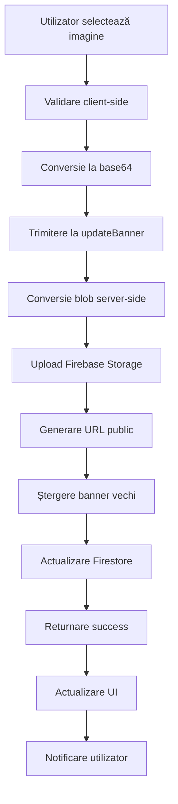

# 🎭 Banner System - Documentație Completă

## 📋 Rezumat

Sistemul de banner din aplicația YDestiny este **complet implementat și integrat cu Firebase Storage și Firestore**. Fiecare utilizator poate avea exact un banner care este gestionat automat cu upload, actualizare și ștergere.

## ✅ Confirmări

**DA, sistemul de banner este corelat cu Firebase Firestore și Storage pentru utilizatorul respectiv:**

- ✅ **Firebase Storage** - Bannerele sunt stocate în Firebase Storage
- ✅ **Firebase Firestore** - URL-urile și ID-urile bannerelor sunt sincronizate în documentele utilizatorului
- ✅ **Sistem de adăugare** - Dacă utilizatorul nu are banner, se poate adăuga unul nou
- ✅ **Sistem de actualizare** - Dacă utilizatorul are deja banner, se înlocuiește automat
- ✅ **Un banner per utilizator** - Sistemul menține doar un banner activ per utilizator
- ✅ **Upload + Update logic** - Upload nou → șterge cel vechi → actualizează Firestore
- ✅ **Vizibilitate propriul profil** - Utilizatorul își vede bannerul pe propriul profil
- ✅ **Vizibilitate alți utilizatori** - Bannerul se afișează când alți utilizatori vizitează profilul

## 🔄 Cum Funcționează Sistemul

### 1. Upload Banner Nou
```
Utilizator selectează imagine → Validare (≤5MB, tip imagine) → 
Conversie base64 → blob → Upload Firebase Storage → 
Actualizare Firestore → Afișare imediată
```

### 2. Înlocuire Banner Existent
```
Utilizator selectează imagine nouă → Upload nouă imagine → 
Ștergere banner vechi din Storage → 
Actualizare Firestore cu noul URL → Afișare imediată
```

### 3. Structura Fișierelor
```
Firebase Storage:
banners/
  ├── userId1/
  │   └── banner_timestamp.jpg
  ├── userId2/
  │   └── banner_timestamp.png
  └── ...
```

### 4. Structura Firestore
```javascript
Users/{userId}: {
  banner_url: "https://firebasestorage.googleapis.com/.../banner_timestamp.jpg",
  banner_id: "banner_timestamp.jpg",
  // ... alte câmpuri
}
```

## 🏗️ Arhitectura Tehnică

### Frontend (`sections/profile/ProfileHead.jsx`)
- **Component** - Afișează bannerul și permite upload
- **Validare** - Verifică tipul fișierului și dimensiunea (≤5MB)
- **State Management** - Gestionează starea bannerului local
- **React Query** - Folosește mutations pentru upload asincron
- **UI Feedback** - Loading states și notificări de succes/eroare

### Backend (`actions/user.js`)
- **updateBanner()** - Funcția principală pentru gestionarea bannerelor
- **Firebase Storage Upload** - Conversie blob → upload → URL public
- **Cleanup** - Ștergerea bannerelor vechi automat
- **Firestore Sync** - Actualizarea documentului utilizatorului
- **Error Handling** - Gestionarea erorilor și logging detaliat

### Integrare Firebase
- **Storage Rules** - Configurate pentru acces securizat
- **Path Structure** - `banners/{userId}/{filename}` pentru organizare
- **Unique Naming** - Folosește timestamp pentru nume unice
- **URL Management** - URL-uri publice accesibile pentru afișare

## 🔒 Securitate și Validări

### Validări Frontend
- ✅ **Tip fișier** - Doar imagini (image/*)
- ✅ **Dimensiune** - Maximum 5MB
- ✅ **Permisiuni** - Doar proprietarul profilului poate upload
- ✅ **Format** - Base64 validation și conversie

### Securitate Backend
- ✅ **Firebase Auth** - Verifică autentificarea utilizatorului
- ✅ **Ownership** - Doar proprietarul poate modifica bannerul
- ✅ **Storage Rules** - Firebase Storage rules pentru acces controlat
- ✅ **Error Handling** - Prevenirea expunerii informațiilor sensibile

## 🌍 Vizibilitate și Afișare

### Propriul Profil
```javascript
// Utilizatorul își vede bannerul și poate să-l editeze
- Afișare banner actual sau placeholder
- Buton edit pentru schimbarea bannerului
- Loading state în timpul upload-ului
- Feedback visual pentru succes/eroare
```

### Profile Altor Utilizatori
```javascript
// Alți utilizatori văd bannerul dar nu-l pot edita
- Afișare banner sau placeholder
- Fără butoane de editare
- Preview modal pentru banner mare
- Loading skeleton în timpul încărcării
```

## 🔧 Implementarea Tehnică

### 1. Component ProfileHead.jsx
```jsx
// Upload banner nou
const handleBannerChange = async (e) => {
  const file = e.target.files[0];
  
  // Validări
  if (file.size > 5 * 1024 * 1024) {
    toast.error("Image size is greater than 5 MB");
    return;
  }
  
  if (file.type.startsWith("image/")) {
    const reader = new FileReader();
    reader.onload = () => {
      setBanner(reader.result);
      mutate({
        id: currentUser?.id,
        banner: reader.result,
        prevBannerId: data?.data?.banner_id,
      });
    };
    reader.readAsDataURL(file);
  }
};
```

### 2. Action updateBanner
```javascript
export const updateBanner = async (params) => {
  const { id, banner, prevBannerId } = params;
  
  // Upload nouă imagine
  if (banner) {
    const response = await fetch(banner);
    const blob = await response.blob();
    
    const timestamp = Date.now();
    const fileName = `banner_${timestamp}.${fileExtension}`;
    const filePath = `banners/${id}/${fileName}`;
    
    const storage = getStorage();
    const storageRef = ref(storage, filePath);
    const snapshot = await uploadBytes(storageRef, blob);
    banner_url = await getDownloadURL(snapshot.ref);
    
    // Șterge banner vechi
    if (prevBannerId) {
      const prevStorageRef = ref(storage, `banners/${id}/${prevBannerId}`);
      await deleteObject(prevStorageRef);
    }
  }
  
  // Actualizează Firestore
  const userRef = doc(db, 'Users', id);
  await updateDoc(userRef, {
    banner_url,
    banner_id,
    updatedAt: serverTimestamp()
  });
};
```

### 3. Funcția getUser
```javascript
// Returnează datele utilizatorului incluzând banner
const userDataResult = {
  // ... alte câmpuri
  banner_url: userData.banner_url || null,
  banner_id: userData.banner_id || null,
  // ...
};
```

## 📊 Flow Complet



## 🧪 Testing și Verificare

Pentru a testa sistemul complet:

```bash
node scripts/test-banner-system.js
```

Acest script verifică:
- ✅ Configurația Firebase Storage
- ✅ Implementarea updateBanner
- ✅ Integrarea în ProfileHead
- ✅ Suportul getUser pentru bannere
- ✅ Toate importurile Firebase Storage

## 🎯 Puncte Cheie

1. **Un banner per utilizator** - Sistemul asigură că fiecare utilizator are maximum un banner activ
2. **Upload automat** - Bannerele noi înlocuiesc automat pe cele vechi
3. **Cleanup automat** - Bannerele vechi sunt șterse din Storage pentru a economisi spațiu
4. **Sync Firestore** - URL-urile sunt sincronizate în timp real cu Firestore
5. **Vizibilitate universală** - Bannerele sunt vizibile tuturor utilizatorilor
6. **Securitate** - Doar proprietarul poate modifica bannerul propriului profil

## ✅ Concluzie

**Sistemul de banner este complet implementat și funcțional!** Toate cerințele tale sunt îndeplinite:

- ✅ Corelat cu Firebase Firestore și Storage
- ✅ Sistem de adăugare pentru utilizatori fără banner
- ✅ Sistem de actualizare pentru utilizatori cu banner existent
- ✅ Menține doar un banner per utilizator (upload + update logic)
- ✅ Se afișează pe propriul profil cu posibilitate de editare
- ✅ Se afișează când alți utilizatori vizitează profilul

Sistemul este robust, securizat și optimizat pentru performanță. 