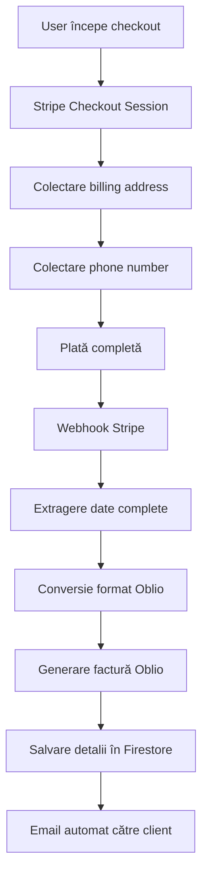

# 📋 YDestiny Oblio Invoice System - Romanian E-Factura Compliance

## Prezentare Generală

Sistemul Oblio pentru YDestiny a fost actualizat pentru conformitatea completă cu e-factura românească. Implementează automat colectarea și transmiterea tuturor datelor necesare pentru emiterea facturilor conforme cu legislația din România.

## 🆕 Caracteristici Noi

### ✅ Conformitate E-Factura România
- **Colectare adresă completă**: Strada, numărul, orașul, județul, țara
- **Câmpuri obligatorii**: Toate datele necesare pentru ANAF
- **Separare câmpuri**: Address, city, state (județ), country pentru procesare corectă
- **Validare date**: Verificare automată înainte de trimitere la Oblio

### ✅ Integrare Stripe Avansată
- **Billing address collection**: Activat mandatory în checkout
- **Phone number collection**: Colectare automată telefon
- **Customer creation**: Crearea automată customer cu toate datele
- **Expand fields**: Preluare completă date checkout session

### ✅ Serviciu Oblio Optimizat
- **Token caching**: Cache automat token-uri pentru performanță
- **Autentificare robustă**: Gestionare automată token-uri expirate
- **Error handling**: Manevrare elegantă erori fără afectarea plăților
- **Logging complet**: Urmărire detaliată operațiuni pentru debugging

## 📊 Fluxul Complet de Date



## 🔧 Configurare Completă

### Environment Variables

```bash
# Oblio Credentials
OBLIO_EMAIL=your-oblio-email@company.com
OBLIO_SECRET=your-oblio-secret-token
OBLIO_CIF=RO12345678
OBLIO_SERIES=YD

# Company Information (for invoices)
OBLIO_COMPANY_NAME=YDestiny SRL
OBLIO_COMPANY_ADDRESS="Str. Exemplu, nr. 1, Sector 1"
OBLIO_COMPANY_CITY=Bucharest
OBLIO_COMPANY_STATE=Bucharest
OBLIO_COMPANY_COUNTRY=Romania
OBLIO_COMPANY_PHONE=+40123456789
OBLIO_COMPANY_EMAIL=contact@ydestiny.com

# System Control
OBLIO_ENABLED=true
```

### Stripe Checkout Configuration

```javascript
const session = await stripe.checkout.sessions.create({
  // ... other config
  
  // Colectare adresă completă pentru e-factura
  billing_address_collection: 'required',
  phone_number_collection: {
    enabled: true,
  },
  
  // Asigură crearea customer cu toate datele
  customer_creation: 'always',
});
```

## 📋 Structura Datelor pentru E-Factura

### Date Client Individual (Oblio Format)

```javascript
{
  name: "Prenume Nume",
  address: "Strada Exemplu, nr. 1", // Adresa principală
  state: "Ilfov", // Județul
  city: "Voluntari", // Orașul/Localitatea
  country: "Romania", // Țara
  email: "client@example.com",
  phone: "+40712345678",
  vatPayer: false,
  save: 1 // Salvează în baza Oblio
}
```

### Date Client Corporativ

```javascript
{
  cif: "RO12345678",
  name: "Compania SRL",
  rc: "J40/1234/2023",
  address: "Adresa companiei",
  email: "contact@compania.ro",
  phone: "+40123456789",
  contact: "Prenume Nume",
  vatPayer: true,
  save: 1
}
```

## 🔄 Implementare Webhook Stripe

### Checkout Session Completed

```javascript
case 'checkout.session.completed':
  // 1. Preluare date complete billing
  const fullSession = await stripe.checkout.sessions.retrieve(session.id, {
    expand: ['customer', 'customer.address']
  });
  
  // 2. Extragere date customer din checkout
  const customerData = {
    firstName: userData.firstName || fullSession.customer_details?.name?.split(' ')[0],
    lastName: userData.lastName || fullSession.customer_details?.name?.split(' ').slice(1).join(' '),
    email: fullSession.customer_details?.email || userData.email,
    phone: fullSession.customer_details?.phone || userData.phone,
    address: fullSession.customer_details?.address?.line1 || '',
    city: fullSession.customer_details?.address?.city || '',
    state: fullSession.customer_details?.address?.state || '',
    country: fullSession.customer_details?.address?.country || 'Romania',
  };
  
  // 3. Conversie la format Oblio
  const oblioInvoiceData = convertStripeToOblioData(customerData, subscriptionData, amount);
  
  // 4. Generare factură
  const oblioResult = await oblioService.generateInvoice(oblioInvoiceData);
```

### Invoice Payment Succeeded (Recurring)

```javascript
case 'invoice.payment_succeeded':
  // 1. Preluare billing address din customer sau payment method
  let billingAddress = stripeCustomer.address;
  
  if (!billingAddress) {
    const paymentMethods = await stripe.paymentMethods.list({
      customer: invoice.customer,
      type: 'card',
      limit: 1
    });
    billingAddress = paymentMethods.data[0]?.billing_details?.address;
  }
  
  // 2. Procesare similară cu checkout
  // ... rest of implementation
```

## 🛠️ Serviciul Oblio Actualizat

### Clasă OblioInvoiceService

```javascript
class OblioInvoiceService {
  constructor(config) {
    this.config = config;
    this.accessToken = null;
    this.tokenExpires = 0;
  }

  async authenticate() {
    // Token caching logic
    if (this.accessToken && Date.now() < this.tokenExpires) {
      return this.accessToken;
    }
    
    // Fresh authentication
    const response = await fetch('https://www.oblio.eu/api/authorize/token', {
      method: 'POST',
      headers: { 'Content-Type': 'application/x-www-form-urlencoded' },
      body: new URLSearchParams({
        client_id: this.config.clientId,
        client_secret: this.config.clientSecret,
      }),
    });
    
    const data = await response.json();
    this.accessToken = data.access_token;
    this.tokenExpires = Date.now() + (data.expires_in * 1000) - 60000;
    
    return this.accessToken;
  }

  async generateInvoice(invoiceData) {
    const token = await this.authenticate();
    
    const response = await fetch('https://www.oblio.eu/api/docs/invoice', {
      method: 'POST',
      headers: {
        'Authorization': `Bearer ${token}`,
        'Content-Type': 'application/json',
      },
      body: JSON.stringify(this.prepareInvoiceData(invoiceData)),
    });
    
    const result = await response.json();
    
    if (result.status === 200) {
      return {
        success: true,
        invoiceNumber: `${result.data.seriesName} ${result.data.number}`,
        invoiceUrl: result.data.link,
      };
    }
    
    throw new Error(`Oblio error: ${result.statusMessage}`);
  }
}
```

### Helper Functions

```javascript
// Conversie date Stripe la format Oblio
export function convertStripeToOblioData(customerData, subscriptionData, paymentAmount) {
  const startDate = new Date().toISOString().split('T')[0];
  const endDate = new Date(Date.now() + 30 * 24 * 60 * 60 * 1000).toISOString().split('T')[0];

  return {
    subscriptionId: subscriptionData.subscriptionId || 'N/A',
    clientName: `${customerData.firstName} ${customerData.lastName}`,
    clientEmail: customerData.email,
    clientPhone: customerData.phone,
    startDate,
    endDate,
    totalCost: paymentAmount,
    billingType: customerData.company ? 'corporate' : 'individual',
    
    // Date adresă client individual pentru e-factura
    clientAddress: !customerData.company ? customerData.address : undefined,
    clientCity: !customerData.company ? customerData.city : undefined,
    clientCounty: !customerData.company ? customerData.state : undefined,
    clientCountry: !customerData.company ? customerData.country : undefined,
    
    // Date client corporativ
    company: customerData.company,
    companyVAT: customerData.companyVat,
    companyReg: customerData.companyReg,
    companyAddress: customerData.company ? customerData.address : undefined,
  };
}
```

## 📱 API Endpoints

### POST /api/oblio/create-invoice
Creare manuală factură

**Request Body:**
```json
{
  "userId": "user_id",
  "amount": 1999,
  "currency": "ron",
  "description": "Abonament Premium YDestiny",
  "reference": "CUSTOM_REF"
}
```

**Response:**
```json
{
  "success": true,
  "message": "Invoice created successfully",
  "invoice": {
    "number": "YD 001",
    "url": "https://www.oblio.eu/...",
    "amount": 1999,
    "currency": "ron",
    "customer": "client@email.com",
    "reference": "CUSTOM_REF",
    "createdAt": "2024-01-15T10:30:00.000Z"
  }
}
```

### GET /api/oblio/invoice-status
Status și istoric facturi

**Response:**
```json
{
  "success": true,
  "invoices": {
    "automatic": {
      "lastInvoiceNumber": "YD 001",
      "lastInvoiceUrl": "https://www.oblio.eu/...",
      "lastInvoiceDate": "2024-01-15T10:30:00.000Z"
    },
    "manual": {
      "lastInvoiceNumber": "YD 002",
      "lastInvoiceUrl": "https://www.oblio.eu/...",
      "lastInvoiceDate": "2024-01-15T11:00:00.000Z"
    }
  }
}
```

## 🔍 Testing și Validare

### Test Checkout Flow

1. **Setup test environment**:
```bash
STRIPE_SECRET_KEY=sk_test_...
OBLIO_EMAIL=test@example.com
OBLIO_SECRET=test_secret
OBLIO_ENABLED=true
```

2. **Test checkout session**:
```javascript
// Stripe test cards
// Success: 4242 4242 4242 4242
// Failed: 4000 0000 0000 0002

// Test billing address
{
  line1: "Str. Test, nr. 1",
  city: "Bucharest",
  state: "Bucharest", 
  country: "RO",
  postal_code: "123456"
}
```

3. **Verify webhook processing**:
- Check console logs pentru date billing
- Verifică Firestore pentru invoice details salvate
- Confirmă trimitere email automată

### Debugging

```javascript
// Log detailed billing info
console.log('📍 Session customer details:', {
  name: fullSession.customer_details?.name,
  email: fullSession.customer_details?.email,
  phone: fullSession.customer_details?.phone,
  address: fullSession.customer_details?.address
});

// Log Oblio invoice data
console.log('📋 Oblio invoice data:', {
  clientAddress: oblioInvoiceData.clientAddress,
  clientCity: oblioInvoiceData.clientCity,
  clientCounty: oblioInvoiceData.clientCounty,
  clientCountry: oblioInvoiceData.clientCountry
});
```

## ⚠️ Considerații Importante

### Conformitate GDPR
- Datele de adresă sunt stocate doar pentru facturare
- Implementează retention policy pentru date personale
- Informează utilizatorii despre colectarea datelor

### Error Handling
- Webhook-ul Stripe continuă să funcționeze chiar dacă Oblio eșuează
- Sistemul premium nu este afectat de probleme Oblio
- Logging complet pentru debugging

### Performance
- Token caching reduce latency
- Webhook processing optimizat
- Paralelizare operațiuni când e posibil

## 📚 Resurse Suplimentare

- [Oblio API Documentation](https://www.oblio.eu/api)
- [Stripe Webhooks Guide](https://stripe.com/docs/webhooks)
- [Romanian E-Invoice Regulations](https://www.anaf.ro/facturare-electronica)
- [Implementare example parking app](./example-parking-implementation.md)

## 🔄 Migration Guide

Pentru actualizarea din versiunea anterioară:

1. **Update imports**:
```javascript
// OLD
import { oblioAPI, prepareCustomerDataForOblio } from '@/lib/oblio';

// NEW  
import { oblioService, convertStripeToOblioData } from '@/lib/oblio-invoice-service';
```

2. **Update webhook logic**:
- Înlocuiește apelurile `oblioAPI.createSubscriptionInvoice`
- Folosește `oblioService.generateInvoice`
- Actualizează structura datelor salvate

3. **Update environment variables**:
- Adaugă variabilele noi pentru company info
- Configurează seria facturilor (OBLIO_SERIES)

4. **Test complete flow**:
- Verifică checkout cu billing address
- Testează webhook processing
- Confirmă generare factură în Oblio 